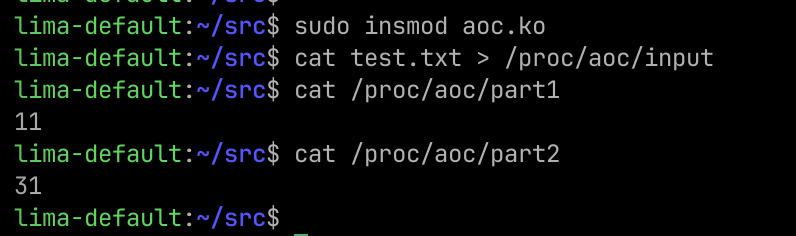

# Advent of Code 2024 day 1

AoC in kernel mode 🤓

The kernel module creates three pseudo files in `/proc` :

- `/proc/aoc/input` : write-only, to send the puzzle input. It triggers the calculation of the solution.
- `/proc/aoc/part1` : read-only, to retrieve the answer of part 1.
- `/proc/aoc/part2` : read-only, to retrieve the answer of part 2.

## Requirements

Requires Linux kernel 5.6+

```shell
sudo apt-get install build-essential linux-headers-$(uname -r)
```

## Compilation

```shell
make
./aoc.sh
```

## Example


